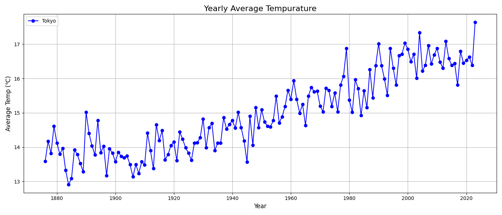
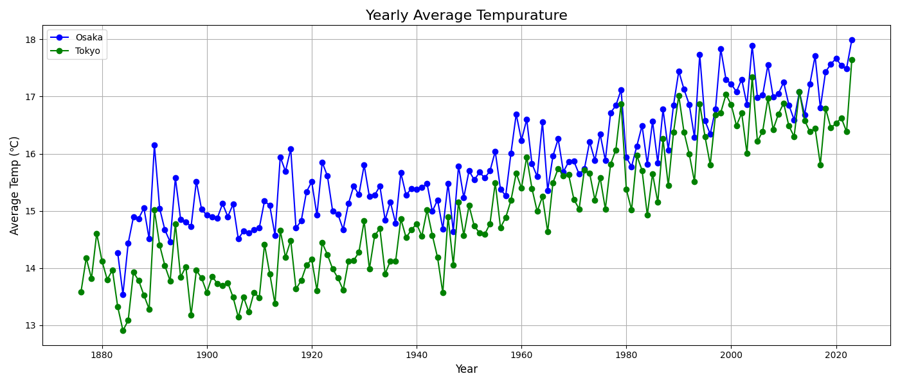

# ClimiteDataAnalysis
This project analyzes climite data to identify trends in temprature.  
このプロジェクトは日本の都市の気候データを分析して，平均気温の傾向を可視化することで気候変動に対する理解を深める目的で始めました。また，pythonの学習目的でもあります。コードの品質があまりよくありませんが，改良を目指しています。

気象データは気象庁サイトからダウンロードし，品質情報が充分なもののみを解析しています。（CSVファイルの品質情報の値が5または8のもののみ）

データは2024年12月までのものを使用しています。

# 方法
気象庁のサイトからダウンロードしたcsvファイルをcsvedit.pyの処理を行い不要な行を削除し，ヘッダを扱いやすいように書き換えました。
pandas,matplotlibを用いて特定の都市の年間平均気温をプロットしました。  
気象庁サイトからダウンロードしたCSVファイルを利用しやすい形に一部変更を加えました。

# スクリーンショット

# 使い方の例
1. Pyhonをインストールする
2. このリポジトリをクローンする:`git clone https://github.com/ygoki/ClimiteDataAnalysis.git`
3. 必要なライブラリをインストールする:`pip install -r requirements.txt`
4. これを実行し，対象の都市名を入力する:`python main.py`

# 参考
気象庁サイト:https://www.data.jma.go.jp/risk/obsdl/index.php  
Python:https://www.python.org  
Pndas:https://pypi.org/project/pandas/  
Matplotlib:https://pypi.org/project/matplotlib/  